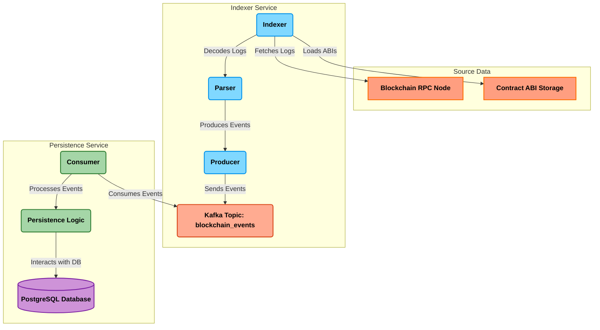

# Stream Event Pipeline

This project processes stream events using a pipeline architecture consisting of two main components: `indexer` and `persistence`. Kafka serves as the message broker facilitating communication between these components.

## Components

-   **Indexer (`indexer/`)**: This component is responsible for consuming raw data streams, processing them, and preparing them for storage. More details can be found in the [indexer README](./indexer/README.md).
-   **Persistence (`persistence/`)**: This component receives processed data from the indexer via Kafka and handles saving it to Postgres. More details can be found in the [persistence README](./persistence/README.md).

## Getting Started

### Prerequisites

-   Docker and Docker Compose installed.

### Configuration

This application is configured using environment variables. An example file listing the required variables can typically be found at `.env.example`.

To set up your local environment:

1.  Copy the example file:
    ```bash
    cp .env.example .env
    ```
2.  Edit the `.env` file and provide the necessary values for your setup.

### Running the Pipeline (Docker Compose)

1.  **Build and Run All Services:**
    This command builds the Docker images for all services defined in `docker-compose.yml` and starts the containers. Use this for the initial setup or when changes have been made to any service.
    ```bash
    docker-compose up --build
    ```

2.  **Stopping the Services:**
    To stop the running containers without removing them:
    ```bash
    docker-compose down
    ```

3.  **Cleaning Up:**
    To stop all running containers, remove them, delete associated volumes (clearing data), and remove orphaned containers:
    ```bash
    docker-compose down --rmi all --volumes --remove-orphans
    ```
    **Caution:** Using `--volumes` will delete any data persisted by the services (like Kafka topics or Postgres data).

## Architecture

The pipeline consists of the following components:

